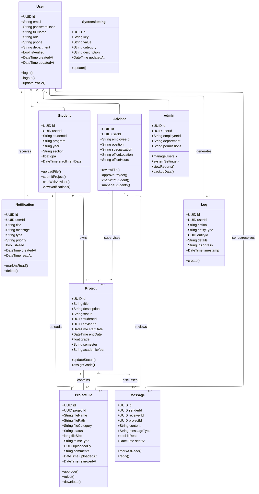

# 📊 Class Diagram & Access Control - Project Management System

## 🏗️ Class Diagram



---

## 🔐 Access Control Matrix

### 👨‍🎓 **STUDENT Permissions**

| Feature | Create | Read | Update | Delete | Notes |
|---------|--------|------|--------|--------|-------|
| **Own Profile** | ❌ | ✅ | ✅ | ❌ | Can view/edit own info |
| **Own Projects** | ✅ | ✅ | ✅ | ❌ | Create/manage own projects |
| **Project Files** | ✅ | ✅ | ❌ | ❌ | Upload files, view status |
| **Messages** | ✅ | ✅ | ❌ | ❌ | Chat with assigned advisor |
| **Notifications** | ❌ | ✅ | ✅ | ✅ | View/mark read/delete own |
| **Other Students** | ❌ | ❌ | ❌ | ❌ | No access to others |
| **Advisors** | ❌ | ✅ | ❌ | ❌ | View assigned advisor info |
| **System Settings** | ❌ | ❌ | ❌ | ❌ | No access |

### 👨‍🏫 **ADVISOR Permissions**

| Feature | Create | Read | Update | Delete | Notes |
|---------|--------|------|--------|--------|-------|
| **Own Profile** | ❌ | ✅ | ✅ | ❌ | Can view/edit own info |
| **Assigned Students** | ❌ | ✅ | ❌ | ❌ | View assigned students |
| **Student Projects** | ❌ | ✅ | ✅ | ❌ | Review/approve assigned projects |
| **Project Files** | ❌ | ✅ | ✅ | ❌ | Review/approve/reject files |
| **Messages** | ✅ | ✅ | ❌ | ❌ | Chat with assigned students |
| **Notifications** | ✅ | ✅ | ✅ | ✅ | Manage own notifications |
| **Grades** | ✅ | ✅ | ✅ | ❌ | Assign/update project grades |
| **Other Advisors** | ❌ | ✅ | ❌ | ❌ | Limited view for collaboration |
| **System Settings** | ❌ | ❌ | ❌ | ❌ | No access |

### 👨‍💼 **ADMIN Permissions**

| Feature | Create | Read | Update | Delete | Notes |
|---------|--------|------|--------|--------|-------|
| **All Users** | ✅ | ✅ | ✅ | ✅ | Full user management |
| **All Projects** | ✅ | ✅ | ✅ | ✅ | System-wide project oversight |
| **All Files** | ❌ | ✅ | ✅ | ✅ | File management/cleanup |
| **All Messages** | ❌ | ✅ | ❌ | ✅ | Moderation purposes |
| **All Notifications** | ✅ | ✅ | ✅ | ✅ | System-wide notifications |
| **System Settings** | ✅ | ✅ | ✅ | ✅ | Full system configuration |
| **System Logs** | ❌ | ✅ | ❌ | ✅ | Audit and monitoring |
| **Reports** | ✅ | ✅ | ❌ | ❌ | Generate system reports |

---

## 🌐 Page Access Control

### 🔓 **Public Pages** (No Authentication)
- `/` - Home page
- `/login` - Login page
- `/signup` - Registration page

### 👨‍🎓 **Student-Only Pages**
```
/student/dashboard          - Student dashboard
/student/projects/[id]      - Project details
/student/projects/[id]/files - File management
/student/projects/[id]/chat  - Chat with advisor
```

### 👨‍🏫 **Advisor-Only Pages**
```
/advisor/dashboard          - Advisor dashboard
/advisor/students          - Assigned students list
/advisor/files/[id]/review - File review interface
/advisor/chat/[id]         - Chat with student
```

### 👨‍💼 **Admin-Only Pages**
```
/admin/dashboard           - Admin dashboard
/admin/users              - User management
/admin/projects           - Project oversight
/admin/settings           - System settings
/admin/reports            - System reports
```

### 🔒 **Shared Pages** (All Authenticated Users)
```
/profile                  - User profile
/notifications           - Personal notifications
```

---

## 🛡️ Security Rules

### 🔐 **Authentication Rules**
1. **JWT Token Required** for all protected routes
2. **Role-based Middleware** validates user permissions
3. **Session Timeout** after 24 hours of inactivity
4. **Password Hashing** using bcrypt

### 🚪 **Authorization Rules**

#### **Students Can:**
- ✅ View own projects and files
- ✅ Upload files to own projects
- ✅ Chat with assigned advisor only
- ✅ Update own profile information
- ❌ Access other students' data
- ❌ Approve/reject files
- ❌ Assign grades

#### **Advisors Can:**
- ✅ View assigned students' projects
- ✅ Review and approve/reject files from assigned students
- ✅ Chat with assigned students
- ✅ Assign grades to supervised projects
- ✅ View student progress reports
- ❌ Access unassigned students' data
- ❌ Modify system settings
- ❌ Delete student accounts

#### **Admins Can:**
- ✅ Full CRUD operations on all entities
- ✅ Assign advisors to students
- ✅ Modify system configurations
- ✅ View system-wide reports and logs
- ✅ Backup and restore data
- ⚠️ **Super Admin** required for critical operations

### 🔒 **Data Protection**
- **Field-level Security**: Sensitive fields hidden based on role
- **Row-level Security**: Users see only relevant data
- **API Rate Limiting**: Prevent abuse
- **Input Validation**: Sanitize all inputs
- **SQL Injection Protection**: Parameterized queries

---

## 📋 **Workflow & Business Logic**

### 📝 **Project Lifecycle**
```
1. Student creates project proposal
2. System assigns advisor (Admin/Auto)
3. Advisor reviews and approves proposal
4. Student uploads progress files
5. Advisor reviews files (Approve/Reject/Request Changes)
6. Student makes revisions if needed
7. Final submission and grading
8. Project completion
```

### 💬 **Communication Flow**
```
Student ←→ Advisor (Direct messaging)
Admin → All Users (System notifications)
System → Users (Automated alerts)
```

### 📊 **File Review Process**
```
Upload → Pending → Under Review → Approved/Rejected
                                 ↓
                           Notification to Student
```

---

## 🏷️ **Role Hierarchy**

```
ADMIN (Highest Privileges)
  ├── Full system access
  ├── User management
  ├── System configuration
  └── Reports & Analytics
      ↓
ADVISOR (Medium Privileges)  
  ├── Assigned students only
  ├── File review & grading
  ├── Project supervision
  └── Communication with students
      ↓
STUDENT (Limited Privileges)
  ├── Own data only
  ├── File upload
  ├── Project management
  └── Communication with advisor
```

---

## 📝 **Class Descriptions**

### 🔵 **Core Entity Classes**

#### 👤 **User (Base Class)**
**Purpose**: ฐานข้อมูลผู้ใช้หลักของระบบ  
**Key Features**:
- เก็บข้อมูลพื้นฐานของผู้ใช้ทุกประเภท
- รองรับ role-based authentication (student/advisor/admin)
- มี email verification และ password reset capabilities
- Track การสร้างและแก้ไขข้อมูล

#### 🎓 **Student**
**Purpose**: ข้อมูลและฟังก์ชันเฉพาะนักศึกษา  
**Key Features**:
- เชื่อมโยงกับ User ด้วย userId
- เก็บข้อมูลทางการศึกษา (program, year, GPA)
- สามารถอัพโหลดไฟล์และสื่อสารกับอาจารย์ที่ปรึกษา
- ดูแลโปรเจคของตนเองได้

#### 👨‍🏫 **Advisor**
**Purpose**: ข้อมูลและฟังก์ชันเฉพาะอาจารย์ที่ปรึกษา  
**Key Features**:
- เชื่อมโยงกับ User ด้วย userId
- เก็บข้อมูลการทำงาน (position, specialization, office)
- สามารถตรวจสอบและอนุมัติไฟล์นักศึกษา
- จัดการหลายนักศึกษาพร้อมกัน

#### 👨‍💼 **Admin**
**Purpose**: ผู้ดูแลระบบที่มีสิทธิ์สูงสุด  
**Key Features**:
- เชื่อมโยงกับ User ด้วย userId
- จัดการผู้ใช้ทั้งหมดในระบบ
- ตั้งค่าระบบและดูรายงาน
- สำรองข้อมูลและการบำรุงรักษา

### 🔶 **Business Logic Classes**

#### 📋 **Project**
**Purpose**: โปรเจคหลักที่นักศึกษาทำงาน  
**Key Features**:
- เชื่อมโยงระหว่าง Student และ Advisor
- ติดตามสถานะโปรเจค (draft, in-progress, completed)
- เก็บคะแนนและข้อมูล timeline
- รองรับหลายเทอมการศึกษา

#### 📁 **ProjectFile**
**Purpose**: ไฟล์ที่เกี่ยวข้องกับโปรเจค  
**Key Features**:
- รองรับหลายประเภทไฟล์ (รายงาน, source code, presentation)
- ระบบ approval workflow (pending, approved, rejected)
- เก็บ metadata ครบถ้วน (size, type, upload time)
- ความเห็นจากอาจารย์ที่ปรึกษา

### 💬 **Communication Classes**

#### 💌 **Message**
**Purpose**: ระบบแชทระหว่างผู้ใช้  
**Key Features**:
- รองรับการสื่อสารแบบ real-time
- เชื่อมโยงกับโปรเจคเฉพาะ
- ระบบ read receipts
- หลายประเภทข้อความ (text, file, notification)

#### 🔔 **Notification**
**Purpose**: ระบบแจ้งเตือนอัตโนมัติ  
**Key Features**:
- แจ้งเตือนตามกิจกรรมต่างๆ (file upload, approval, deadlines)
- จัดลำดับความสำคัญ (high, medium, low)
- ระบบ mark as read
- สามารถลบได้

### ⚙️ **System Support Classes**

#### 🔧 **SystemSetting**
**Purpose**: การตั้งค่าระบบทั้งหมด  
**Key Features**:
- เก็บค่า configuration แบบ key-value
- จัดหมวดหมู่การตั้งค่า
- สามารถแก้ไขได้แบบ dynamic
- มี description สำหรับแต่ละค่า

#### 📊 **Log**
**Purpose**: บันทึกการใช้งานระบบ  
**Key Features**:
- ติดตามการกระทำของผู้ใช้ทั้งหมด
- เก็บข้อมูล IP address และ timestamp
- ใช้สำหรับ audit และ security monitoring
- รองรับการค้นหาและ filtering

---

**Last Updated**: September 18, 2025  
**Status**: Current system design with detailed documentation  
**Presentation Script**: See [PRESENTATION_SCRIPT.md](./PRESENTATION_SCRIPT.md) for detailed presentation materials